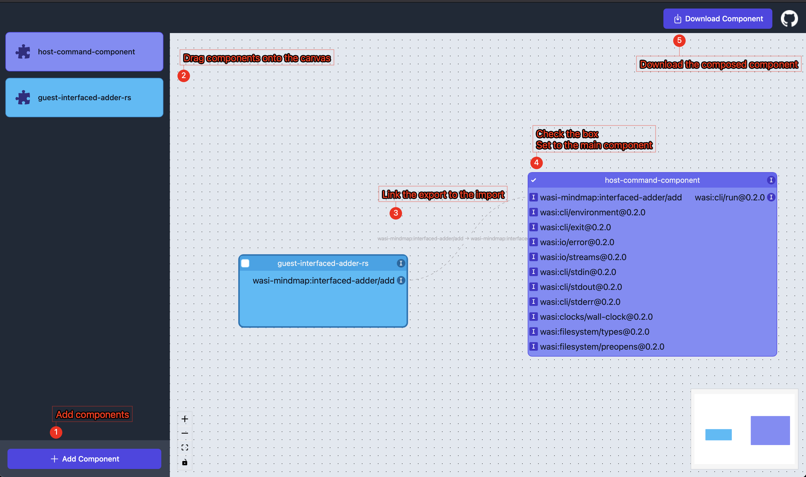

# Reference
https://component-model.bytecodealliance.org/language-support/rust.html#importing-an-interface-into-a-command-component

# Build Steps
1. Build the host-command-component: `cargo component build`
2. Make sure you have built `guest_interfaced_adder_rs.wasm`. If not,
   `cd ../guest-interfaced-adder-rs && cargo build --release --target wasm32-wasip2`
3. Compose `host-command-component.wasm` in e.g. `../target/wasm32-wasip1/debug/host-command-component.wasm` and
   `guest-interfaced-adder-rs` on [wasmbuilder.app](https://wasmbuilder.app/).
   
    * Alternatively, you can use WAC language and `wac` to programmatically compose components.
      See [compose with WAC](https://component-model.bytecodealliance.org/creating-and-consuming/composing.html#advanced-composition-with-the-wac-language).
4. Run the host component with `wasmtime`: `wasmtime run <the-name-of-your-choice-when-downloading-the-component>.wasm`